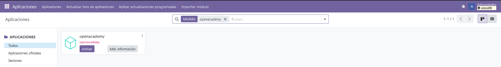

# Módulo de Odoo

## Configuración de Docker Compose

El archivo `docker-compose.yml` contiene la configuración de los servicios de PostgreSQL y Odoo.

```yaml
services:
  db:
    image: postgres:latest
    environment:
      POSTGRES_DB: odoo
      POSTGRES_USER: odoo
      POSTGRES_PASSWORD: odoo
      PGDATA: /var/lib/postgresql/data/pgdata
    ports:
      - "5432:5432"
    volumes:
      - postgres_data:/var/lib/postgresql/data/pgdata

  odoo:
    image: odoo:latest
    depends_on:
      - db
    ports:
      - "8069:8069"
    volumes:
      - odoo_data:/var/lib/odoo
      - ./extra-addons:/mnt/extra-addons
```

Tenemos que entrar en el contenedor:

docker exec -u root -it odoomodulo-odoo-1 /bin/bash

Si no sabemos el nombre de nuestro contenedor podemos usar este comando:

docker ps

Entramos en la carpeta **extra-addons**

cd /mnt/extra-addons/

Creamos el modulo

odoo scaffold openacademy

Para poder modificar el modulo tendremos que cambiar los permisos

chown -R 777 openacademy

Ahora si vemos el arbol de nuestro proyecto dentro de extra-addons tendremos una carpeta llamada **openacademy**, este es nuestro módulo.


Haremos algunas modificaciones en algunos archivos:

**__manifest__.py**

```yaml
# -*- coding: utf-8 -*-
{
    'name': "openacademy",

    'summary': "resumen del modulo",

    'description': """ tarea: creacion de un modulo en odoo""",

    'author': "Sandra Lopez",
    'website': "https://www.sandraopenacademy.com",

    # Categories can be used to filter modules in modules listing
    # Check https://github.com/odoo/odoo/blob/15.0/odoo/addons/base/data/ir_module_category_data.xml
    # for the full list
    'category': 'Uncategorized',
    'version': '0.1',

    # any module necessary for this one to work correctly
    'depends': ['base'],

    # always loaded
    'data': [
        'security/ir.model.access.csv',
        'views/views.xml',
        'views/templates.xml',
        'data/datos.xml'
    ],
    # only loaded in demonstration mode
    'demo': [
        'demo/demo.xml',
    ],
}
````

**models.py**

```yaml
# -*- coding: utf-8 -*-

from odoo import fields, models

class TestModel(models.Model):
    _name = "Test Model"
    _description = "test_model"

    name = fields.Char(string="Nombre", require=True)
    description = fields.Text()
```

**views.xml**

```yaml
<odoo>
  <data>
    <!-- explicit list view definition -->

    <record model="ir.ui.view" id="openacademy.list">
      <field name="name">openacademy list</field>
      <field name="model">test_model</field>
      <field name="arch" type="xml">
        <tree>
          <field name="name"/>
          <field name="description"/>
        </tree>
      </field>
    </record>


    <!-- actions opening views on models -->

    <record model="ir.actions.act_window" id="openacademy.action_window">
      <field name="name">openacademy window</field>
      <field name="res_model">test_model</field>
      <field name="view_mode">tree,form</field>
    </record>


    <!-- server action to the one above -->
<!--
    <record model="ir.actions.server" id="openacademy.action_server">
      <field name="name">openacademy server</field>
      <field name="model_id" ref="model_openacademy_openacademy"/>
      <field name="state">code</field>
      <field name="code">
        action = {
          "type": "ir.actions.act_window",
          "view_mode": "tree,form",
          "res_model": model._name,
        }
      </field>
    </record>
-->

    <!-- Top menu item -->

    <menuitem name="openacademy" id="openacademy.menu_root"/>

    <!-- menu categories -->

    <menuitem name="Menu 1" id="openacademy.menu_1" parent="openacademy.menu_root"/>
    <menuitem name="Menu 2" id="openacademy.menu_2" parent="openacademy.menu_root"/>

    <!-- actions -->

    <menuitem name="List" id="openacademy.menu_1_list" parent="openacademy.menu_1"
              action="openacademy.action_window"/>
<!--
    <menuitem name="Server to list" id="openacademy" parent="openacademy.menu_2"
              action="openacademy.action_server"/>
-->
  </data>
</odoo>
```


**ir.model.access.csv**

```yaml
id,name,model_id:id,group_id:id,perm_read,perm_write,perm_create,perm_unlink
access_openacademy_openacademy,openacademy.openacademy,model_test_model,base.group_user,1,1,1,1
```

En Odoo, buscaremos nuestro modelo **openacademy** y nos aparecera aqui (es importante tener el modo desarollador activado en Odoo)



## Tablas en Odoo e IDE
Tenemos que crear la conexion con la base de datos, utilizaremos postgres


Tabla que nos aparece en Odoo


Tabla IDE


